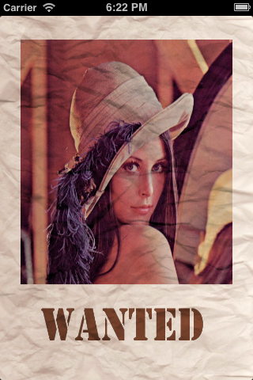
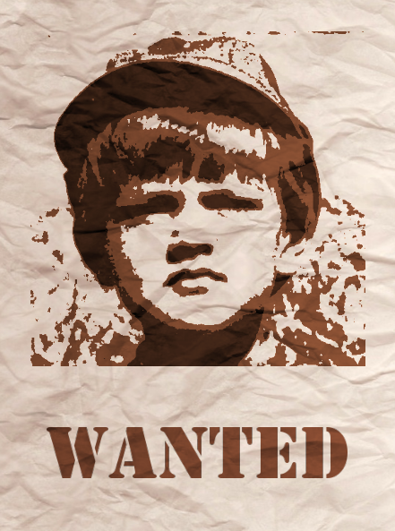
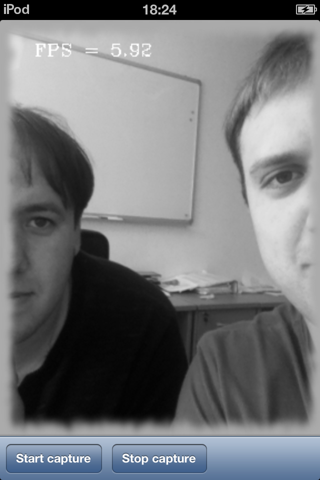
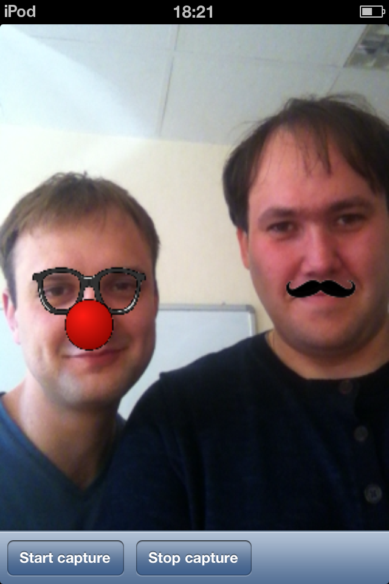

OpenCV for iOS (samples for the book)
=====================================

 - Authors: Alexander Shishkov and Kirill Kornyakov
 - Book: <http://bit.ly/OpenCV_for_iOS_book>
 - Copyright: Packt Publishing 2013
 - License: see the `LICENSE.txt` file

Build & run sample projects
---------------------------

Almost every chapter of the book describes a separate project. There are 15
Xcode projects for 17 chapters in the book. Chapter 16 extends the project of
Chapter 14, and for Chapter 17 you need only OpenCV source code.

- First of all you will need a computer with Mac OSX and Xcode. An iOS device
  is also helpful, since not all samples can be executed on Simulator.
- Install OpenCV v2.4.6 or newer. You can go to <http://opencv.org>, click on
  _Downloads_, and download the latest OpenCV framework for iOS. Copy it to the
  folder with this code.
- Now you can import sample projects to Xcode and run them on Simulator or a
  real device.

For detailed instructions and explanations please refer to the book.

Chapters
--------

  1. _Getting Started with iOS_ helps you to setup your development environment
     and run your first "Hello World" iOS application.
  2. _Displaying Image from Resources_ introduces you to basic GUI concepts on
     iOS, and covers loading of an image from resources and displaying it on the
     display.
  3. _Linking OpenCV to iOS Project_ explains how to link OpenCV library and
     call any function from it.
  4. _Detecting Faces with Cascade Classifier_ shows how to detect faces using
     OpenCV.
  5. _Printing Postcard_ demonstrates how a simple photo effect can be
     implemented.
  6. _Working with Images in Gallery_ explains how to load and save images
     from/to Gallery.
  7. _Applying Retro Effect_ demonstrates another interesting photo effect,
     which makes photos look old.
  8. _Taking Photos From Camera_ shows how to capture static images with camera.
  9. _Creating Static Library_ explains how to create a Static Library project
     in Xcode.
  10. _Capturing Video from Camera_ shows how to capture video stream from
      camera.
  11. _Control Advanced Camera Settings_ explains how to control advanced camera
      settings, like exposure, focus and white balance.
  12. _Applying Effects to Live Video_ shows how to process captured video
      frames on the fly.
  13. _Saving Video from Camera_ explains how to save video stream to the device
      with hardware encoding.
  14. _Optimizing Performance with ARM NEON_ explains how to use SIMD
      instructions to vectorize you code and improve performance.
  15. _Detecting Facial Features_ presents a simple facial feature detection
      demo.
  16. _Using Accelerate Framework_ explains how to link the framework, and how
      to use it for performance optimization.
  17. _Building OpenCV for iOS from sources_ explains where to get and how to
      build the latest OpenCV sources.

Screenshots
-----------

### Chapter 5. "Printing Postcard"

### Chapter 6. "Working with Images in Gallery"

### Chapter 7. "Applying Retro Effect"

### Chapter 12. "Applying Effects to Live Video"

### Chapter 15. "Detecting Facial Features"
